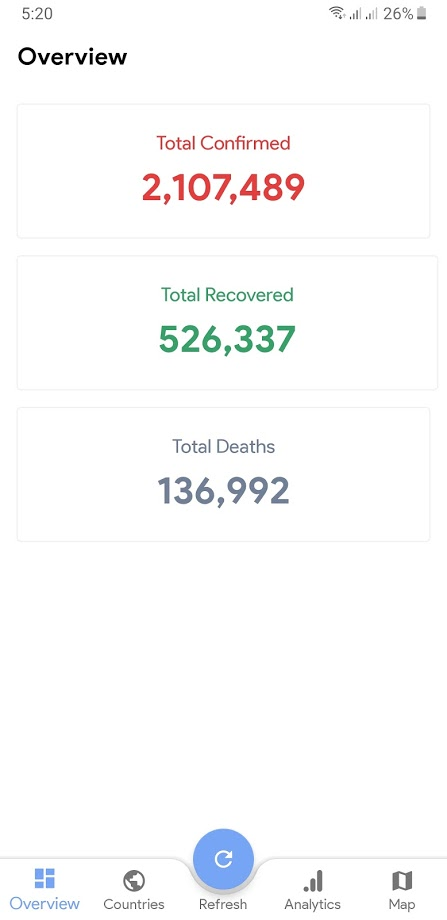
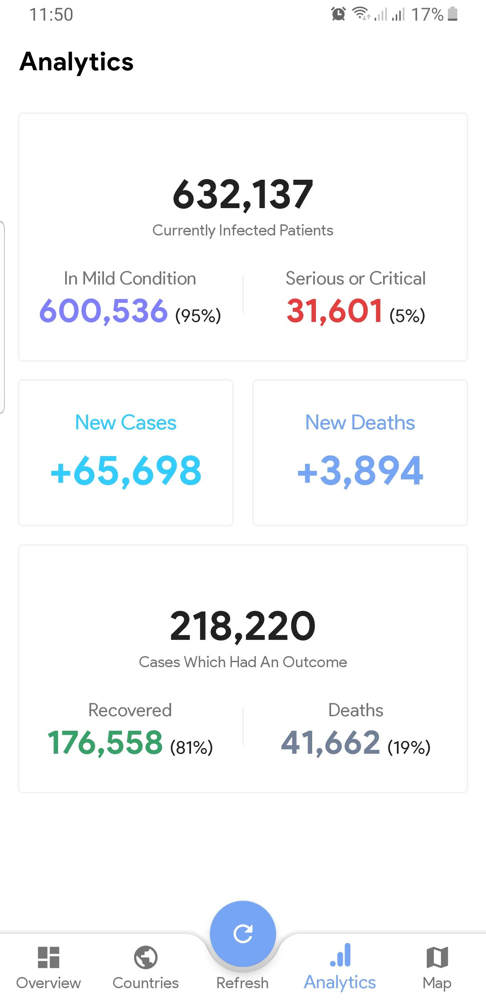
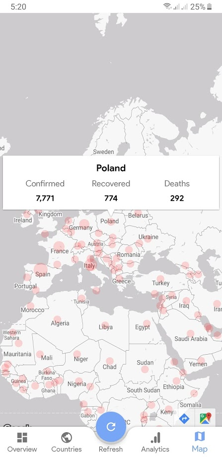
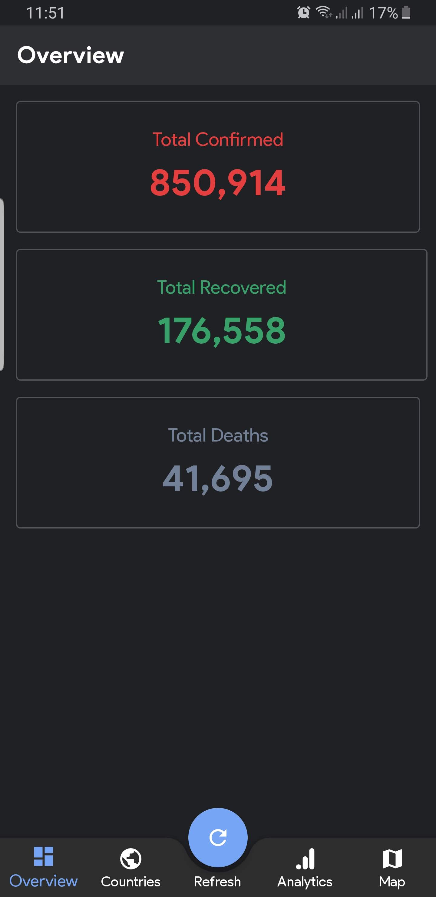
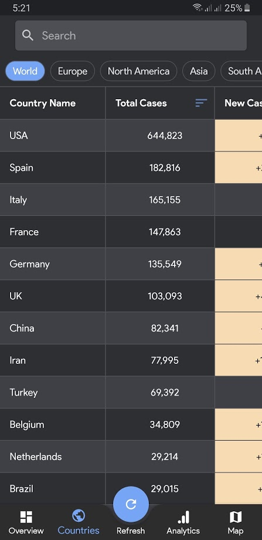
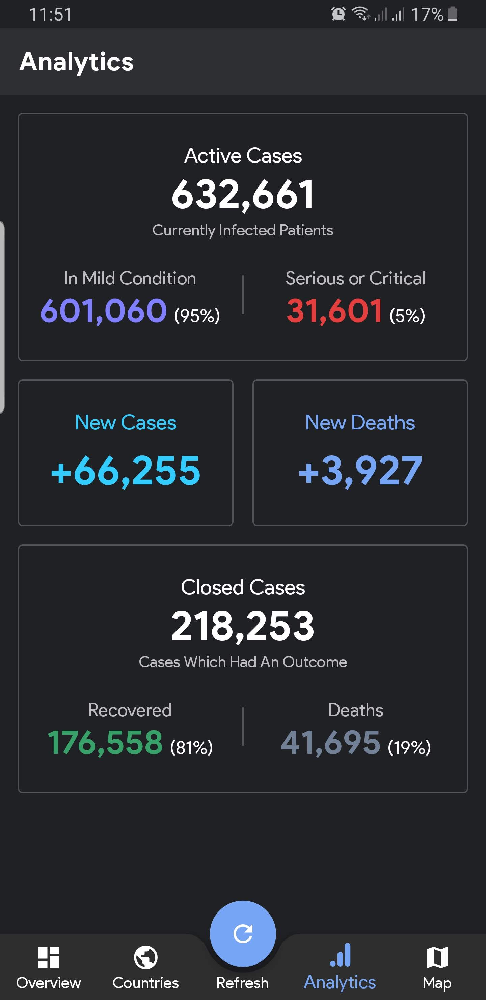
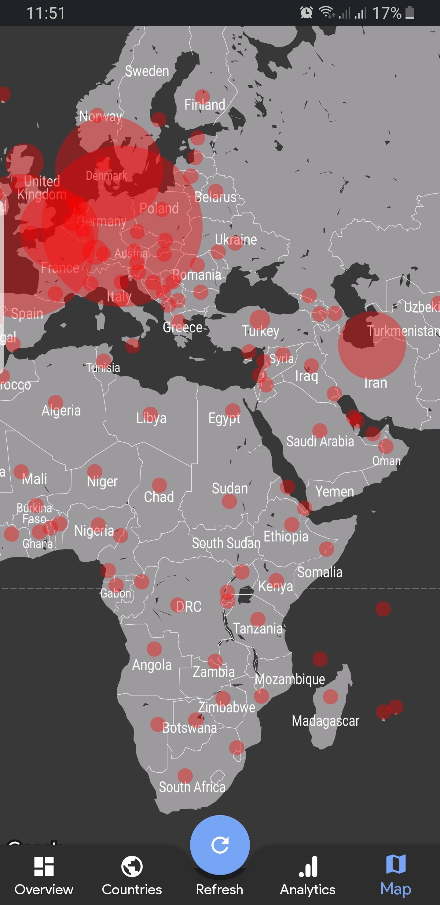
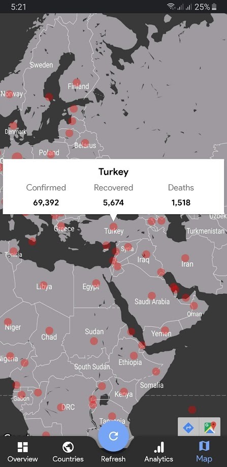

# Covid-19 Tracker

Covid-19 Tracker is an open source android App for tracking coronavirus (Covid19 / 19nCov) cases in the World.

## Libraries, Languages and Concepts
- Kotlin
- Modularization
- MVVM Architecture
- Material Design
- AndroidX
- Kotlin Coroutines
- Retrofit 2
- OkHttp 3
- Dagger 2
- Google Maps
- Jspoon
- Abdroid Architecture Component

## Sources:
> https://www.worldometers.info/coronavirus/

## Demo:
      

### Dark Mode
     

## Known Issues
- ~~Lag occurred while navigate to any fragment after data loaded successfully~~
- ~~Lifecycle~~

## Not Implemented
- Data source information screen and cases summary
- Last updates screen
- About screen contains open sources libraries
- Support other languages and directions
- ~~Support Nigh Mode~~
- Unit Testing

## Contributing
Pull requests are welcome. For major changes, please open an issue first to discuss what you would like to change.
